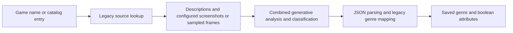
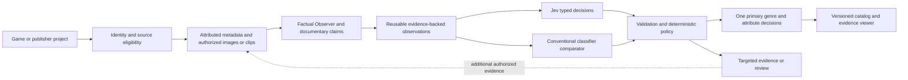

GameTagger: bounded product build and Jev evaluation plan

Owner handoff · September 18–19, 2026 (Pacific)

This is an implementation brief, not a claim that an unattended Codex session has been started. The latest addition makes a Jev effectiveness scorecard and old-versus-new pipeline visualizations required website deliverables.

Execution directive

Work in kpflynn82/gametagger. Implement this plan in the current authorized Codex environment. Do not respond with another plan and stop. Inspect the existing work, make reviewable changes, run tests, and deliver a working website plus an honest status and measurement report.

This brief replaces the earlier PR-B-only scope: the owner now explicitly wants the website, roadmap view, and final product layout/design developed alongside the classification improvements. Reuse completed work rather than restarting. Do not wait for this ChatGPT conversation to respond between milestones. No reliable automatic two-way handoff from this chat to Codex has been established.

Proceed through the finite milestones below within the runtime and permissions actually available. Do not create indefinite polling loops, assume the session runs forever, or claim overnight execution that has not happened. When one task is blocked, complete independent authorized work and record the blocker. Save a resumable checkpoint before stopping.

1. Overarching product outcome

Build GameTagger, a platform-neutral website that uses verified game metadata together with gameplay screenshots and video to identify a game’s primary genre and meaningful attributes: visual style, camera perspective, combat, movement, progression, world structure, narrative, and social features.

The user should be able to identify or submit a game, provide or select appropriate evidence, run an analysis, inspect its result and supporting material, correct mistakes, and find the saved game later. The product should work for PC, console, and mobile games, including a publisher’s unreleased project without an existing store listing.

For a valid game with sufficient evidence, output exactly one store-facing primary genre, selected from the highest-ranked eligible genre. Show that primary first and prominently. Up to two secondary alternatives are optional and visually subordinate. Do not make a store user assemble their primary genre from numerous categories. Keep detailed overlapping properties in the Genome attributes.

A record whose identity is unresolved, whose model execution failed, or whose evidence cannot support classification must not receive an invented default genre. These are distinct intake/execution/evidence states, not additional genres. Every published catalog game should ultimately have one approved primary through sufficient evidence or an authorized human review.

Success means a more useful and accurate tagging product—not more infrastructure, a new taxonomy, or adopting Jev for its own sake. Retain Jev only where matched tests show a worthwhile quality, useful-coverage, total-latency, or cost benefit. A conventional classifier is an acceptable winner. The product must not become a text-only catalog classifier or stop at a CLI.

2. Functional reference and starting point

Functional reference: https://genometagger.vercel.app/. Treat it as an existing product to learn from, not a visual template or a database to modify.

The original frontend source in kpflynn82/gametagger-web exposes Dashboard, Browse Games, Add New Game, Tag Glossary, About, and an admin Bulk Genre Classifier. Preserve or improve those underlying user jobs. Do not clone its Xbox branding, dark/green styling, hardcoded online indicators, unsupported accuracy metrics, or implementation defects. Public-page rendering could not be verified while this brief was prepared; inspect the actual site read-only where possible, and distinguish live behavior from repository documentation. Do not invoke its analysis/debug endpoints, make paid requests, or change records during discovery.

The new gametagger repository already includes a Python/FastAPI foundation, a single-image Observer, Jev integration, the v4.1 hierarchy, typed results, source-identity eligibility and component-level failure handling. PRs #1–#3 were observed merged during the preceding work. This is a starting checkpoint, not a guarantee that the repo remains unchanged.

Save this brief as docs/CODEX_BUILD_PLAN.md and keep a short pointer in the root AGENTS.md; do not paste the entire long brief into that instruction file. Read the brief explicitly. Read current AGENTS.md, README, architecture/roadmap, all relevant open PRs, CI, and the source-integrity and taxonomy documents. Record the actual starting SHA. Check uncommitted changes and existing workers; do not overwrite them or duplicate their tasks.

Do not make a NitroGen import or model-training project a prerequisite. Any NitroGen-derived names and historical machine tags are intake data, not adjudicated ground truth. Reuse permitted, verified publisher media first; bulk dataset acquisition or training needs a separate provenance/rights decision.

The 100-record replay supplied by the owner is a descriptions-only intake stress test, not a clean 100-game accuracy benchmark. It reported 34 changed genres, 33 unchanged, 23 insufficient evidence, three final contract errors, and seven new primaries. Fifteen records lacked descriptions. Source-title flags were not confirmed mismatch counts. Preserve the original artifacts where accessible; do not recreate missing raw data from this summary.

3. Scope, autonomy, approvals, and spending

Authorized work

You may make routine implementation and design decisions, add justified dependencies, update documentation, run local/offline tests, replay retained responses, build the website, create feature branches and PRs, and inspect the new repository’s existing work. Use the current environment’s authorized coding tools and account quota; do not purchase additional capacity.

The owner permits reviewed changes to reach main when applicable tests pass. Prefer small PR merges rather than direct pushes. Apply the review and merge gate in section 12; permission to merge is not permission to bypass protected branches, fabricate independent review, or deploy production.

Not authorized without a new explicit decision

Do not modify kpflynn82/genometagger, kpflynn82/gametagger-web, the original database, or the existing deployed site. Do not delete historical evidence, force-push, change repository visibility/permissions, rotate account secrets, weaken security controls, contact vendors, acquire paid datasets, expose private footage, or launch new paid infrastructure. Existing assets’ availability does not establish permission to redistribute them.

No total external-model API budget has been supplied. Therefore do not initiate new billable Jev/Anthropic/other model experiments. Existing keys are not spending approval. Implement real provider paths, opt-in tests, and estimates, but use offline mocks, saved-response replay, and authorized local preprocessing for this session unless the owner subsequently provides a numeric cap. If a cap is provided, count all providers/retries against it, stop before the cap with a conservative margin, and do not raise it automatically. Unknown usage must remain unknown.

Do not turn this boundary into a reason to stop building. The website, persistence, media processing, replay, evaluation logic, fixtures, and provider integration tests can proceed without paid inference. Do not count mock/replayed runs as new live validation.

A runtime tool denial, authentication barrier, or protected-branch restriction is not overridden by this brief. Report it and continue independent work without trying alternate routes to evade it.

4. Non-negotiable system behavior

Use this conceptual flow while retaining useful existing interfaces:

Identity/source eligibility → evidence acquisition → factual observation → provider-neutral classification → deterministic policy → persisted result → review/catalog/export

The Observer records what supplied material shows; it does not assign genres or silently promote promotional text into visual facts. A single image cannot establish action timing. Source text and on-screen text are untrusted data, not model instructions. Metadata claims must remain attributed.

Keep present, absent, insufficient_evidence, and conflicting_evidence separate from execution states such as failed, not evaluated, or partially complete. Not observed is not absent. Missing legacy keys are unknown, not false. Do not confuse model-preferred labels with publishable results.

Retain raw provider distributions unchanged, derived scores separately, actual returned/requested model versions, prompt/taxonomy versions, evidence references, and all available usage/errors. Never silently normalize malformed provider output or loosen the current probability-total tolerance to obtain a green run. A failed tag must not erase unrelated valid decisions. A failed required genre dependency must not be dropped and its remaining mass renormalized into a manufactured winner.

Keep the current 14 families, 100 primary-capable genres, and 25 pilot attributes fixed for the first comparisons. Do not add mobile tags or hundreds of new categories tonight. Build the UI and data model so later mobile-specific controls, monetization, and engagement attributes can be added cleanly.

Treat the taxonomy hierarchy and the inference algorithm separately. Current hierarchical aggregation remains a reference method; direct classification over the same label set is an experimental comparator. Do not assume multiplying independently elicited model scores creates calibrated real-world probabilities. Keep one primary output whichever method is used.

Distinguish context_evidence_ids from genuinely assessed supporting or contradicting evidence. Never present every input asset as proof for every tag. If specific support has not been established, show “Evaluated context; specific support not yet verified.”

5. Website deliverable: real application, original design

Build a responsive, working application in this repository—not just a landing page, static mockup, CLI wrapper screenshot, or project-status HTML. Preserve the current backend package and add a frontend, preferably React/TypeScript with Vite if no suitable frontend already exists. Use a coherent component system and avoid a gratuitous framework rewrite.

Design direction

Use a light-first, editorial software-workspace style: warm off-white canvas, graphite/slate typography, restrained indigo actions, amber attention states, and neutral surfaces. Use a new simple wordmark or geometric mark and system/open-source type already permitted in the project. No Xbox logo, Xbox green identity, platform-branded navigation, gaming-console motifs, or copied assets. Treat this as a proposed implementation direction, not a separate approval gate.

Desktop layout: compact left navigation, a restrained top bar with environment and actual system status, and a spacious main workspace. On mobile, collapse navigation into an accessible menu and prioritize the analysis action and primary result. Use normal readable typography, clear section hierarchy, modest rounding, and purposeful data tables rather than a wall of decorative KPI cards.

Build at least desktop and narrow-phone layouts. Validate around 1440, 768, and 390 pixels. Use keyboard navigation, visible focus, labelled inputs, sufficient contrast, reduced-motion support, readable errors, and semantic loading/status messages. Status must not depend on color alone. Do not claim WCAG certification from a spot check.

Separate primary user navigation—Overview, Analyze, Catalog, Taxonomy—from admin tools—Review, Jev Impact / Experiments, Roadmap, Settings. About/methodology is available from the footer or help area. Admin authorization must be server-enforced, not merely hidden navigation.

Screen A: Overview

Provide a clear “Analyze a game” action and a secondary “Browse catalog” action. Show actual recent runs, completed/partial/failed jobs, review workload, and documented input capabilities. Keep unique games, releases, and analysis runs distinct.

Genre/attribute charts summarize the selected dataset only; do not label an imported sample as market share. Accuracy, speedup, and savings appear only when a traceable matched experiment exists. Otherwise show “Not measured.” Do not resurrect average model confidence as “Classification Accuracy.”

Show real empty states before there is data. A demonstration dataset may be offered explicitly, but its records and statistics must stay separate from real results.

Screen B: Analyze / Add Game

Provide three entry paths: game/store reference, publisher project, and explicit demo/replay. For this session, metadata/manual project identity and local image uploads must work. A title-only lookup can produce candidates but cannot silently verify a retrieved product.

Allow game/release/platform selection, descriptions with source attribution, multiple screenshots, and local gameplay video as implemented in the media milestone. Preserve the chosen canonical/source IDs through the pipeline. Show source candidates, mismatches, related editions, and unresolved associations before those sources enter classification. An uploader can explicitly associate their own files with a project without requiring an external listing.

Show accepted file types, configured size/duration limits, identity status, evidence included/excluded, model availability, and live-spend state before submission. Do not advertise a functioning YouTube downloader or mobile-store connector if only a URL field exists. Unsupported links can be stored as references and clearly labelled; they are not analyzed footage.

Replay may reuse a saved model response only against its exact evidence/model/prompt/taxonomy provenance. A fresh arbitrary image submitted in offline mode must not receive the canned tags of a different sample: show pipeline-shape-only unknowns or explain that live analysis is disabled.

Use genuine job progress: queued, validating sources, preparing media, observing, classifying, applying policy, completed/partial/failed/cancelled. Do not fake timer-based progress. Show a resume/retry action only when it is implemented safely and idempotently.

Screen C: Game analysis result

Above the fold: title/release, identity status, one prominent primary genre, optional secondary alternatives, analysis status, and a compact evidence summary. Distinguish provisional model choice from approved catalog metadata. When unresolved, explain whether the blocker is identity, unavailable evidence, or execution failure; do not display a plausible default genre.

Below: grouped Genome attributes, evidence viewer, alternative ranking, and analysis history. Each attribute exposes semantic state, observed/documented support, the underlying observations, relevant evidence where assessed, and uncertainty. Display model scores as model scores, not accuracy or percentage of gameplay time. Keep full distributions available in an inspector rather than flooding the primary view.

Use screenshot thumbnails and a video player with timestamped evidence where permitted. Selecting an observation should open its source image or seek its recorded clip time. If footage is not retained, show its reference and explain that playback is unavailable. Do not generate timestamps or proof snippets.

Provide review/edit, reanalyze, and JSON/CSV export actions backed by real endpoints. Save all completed and partial analysis runs automatically; a “Publish/approve” action is separate. Human corrections are versioned and survive reanalysis rather than being silently overwritten.

Screen D: Browse Games / Catalog and history

Provide search, pagination, sorting, and filters for primary genre/family, supported attribute, platform/release, review status, input type, and date. Display the primary first in every row/card. Unknown attributes must not match filters asking for present or absent. Distinguish catalog entries from analysis history so five runs of one game do not become five games.

Open full result details; permit exports scoped to the selected dataset and authorized user. Preserve stable IDs and display names. No cross-workspace visibility or automatic publication of uploaded metadata.

Screen E: Taxonomy / Tag Glossary and About

Render the actual canonical hierarchy with search, definitions, boundaries, and the difference between primary genres and attributes. Show the current version and the 25-tag pilot coverage honestly. Do not maintain a second frontend taxonomy.

Explain what images, ordered clips, and metadata can establish; explain abstention and evidence provenance. State limitations and how documented claims differ from visual observation. Do not make unsupported accuracy, calibration, vendor, or speed claims.

Screen F: Review and bulk intake

Use separate queues for identity resolution, disputed attributes, incomplete execution, and genre ambiguity. Show source title/product ID, subject release, observed/documented evidence, and conflicts. Record reviewer identity, reason, timestamps, and before/after decisions. Only authorized reviewers can change publication/identity approvals.

Bulk intake accepts a bounded CSV/JSON manifest with dry-run validation, explicit per-row state, and duplicate warnings. Reuse batch jobs; do not implement an unlimited synchronous paid loop. With no approved budget, intake may validate and queue blocked-live records or run replay, not call providers. Original legacy data stays read-only. Missing assets or human labels stay pending.

Screen G: Jev Impact / Experiments — mandatory, not a later nice-to-have

Build /experiments with a dedicated Jev-versus-baseline comparison view. Read real experiment artifacts into a side-by-side report with baseline/candidate IDs, selected cohort, sample size, label-review status, code/model/prompt/taxonomy versions, evidence hashes, and explicit comparison eligibility. Show per-game failures and changes, not only averages. Mark mocks, historical replay, new live runs, and human-reviewed evaluations distinctly. Until matched results exist, render an honest empty scorecard and a labelled historical replay panel—not illustrative numbers in a live-looking dashboard.

The page must answer: Is Jev helping this product, where does it help, and is the benefit worth any accuracy/coverage tradeoff? Jev is not presumed the winner. Include an evidence-limited recommendation such as “inconclusive,” “promising on this slice,” “prefer non-Jev on this slice,” or “candidate for promotion.” No automatic promotion from a green chart.

Implement these visual components incrementally:

1. Headline scorecard: actual primary correctness, accepted attribute precision, end-to-end recall, useful coverage, median/p95 total latency, cost per useful result, and execution error rate. Columns: baseline, candidate, change, paired sample size, and evidence status. Missing measurements render “Not measured,” not zero. One fast component must not be labelled total-system speedup.
2. Side-by-side pipeline diagrams: old combined generative-classifier flow versus the new identity/evidence/Observer/Jev/policy flow. A separate toggle holds shared observations constant and switches between Jev and a conventional classifier. Mark unchanged, new, bypassed, and unimplemented stages. The diagram labels are about implemented behavior, not architecture aspirations. Record whether legacy media was actually enabled.
3. Per-stage performance view: display acquisition, media preparation, Observer, classifier, retries, policy/persistence, queue time and total wall clock. Use a trace/Gantt or justified latency breakdown; do not double-count overlapping concurrent spans. Show cold/cached conditions and request concurrency. Allow latency and cost views, but mark unknown cost segments.
4. Quality versus coverage: compare methods at matched precision or matched coverage. A system declining most games must not look superior merely because its accepted subset is easier. Show available sample counts; defer curves until data supports them.
5. Where Jev helps: a per-tag or tag-family delta chart plus a genre confusion view. Filter PC/console/mobile, metadata/media/combined, known/unfamiliar identities, and selected evidence classes. Sparse slices show counts and a warning, not rankings presented as settled truth.
6. Case comparison drawer: original input identifiers, verified source relationships, relevant images/clips, cached observations, old/new decisions, full available distributions, execution states, human label provenance, and categorized failure cause. Categories include identity, unavailable/unsuitable evidence, Observer omission/inference, classification, aggregation/policy, and provider execution. Cause labels are proposed unless reviewed.
7. Calibration view when supported: plot predicted probabilities against evidence-supported outcomes with bucket counts. Use distributions only where the target and provider output are compatible. A legacy high/medium badge is not a calibrated probability; do not invent one for a Brier score.

Charts and diagrams must be accessible: text labels, keyboard-selectable nodes, tooltips with sources, table equivalents, and a static printable fallback. On mobile stack the two flows vertically. Use diagram components/SVG/HTML that render in the actual website; Mermaid source in documentation alone does not satisfy the website requirement. Stage details expose only authorized data. Do not send an entire private evidence pack to the browser merely to render the graph.

A chart backed by mock fixtures must have an unmistakable “Illustrative / UI test data” watermark and must never appear in live aggregate results. Prefer the empty measured-state screen for the default install. Add tests that no effect size can be computed when cohorts, evidence hashes, taxonomy crosswalks or run conditions are incompatible.

Screen H: Roadmap / Tonight

Build the roadmap view the owner requested. Each finite milestone below has a goal, definition of done, status, dependency, branch/PR/SHA, latest test artifact, blocker, and next action. Use planned/in progress/ready for review/merged/blocked/deferred; keep “implemented,” “tested,” and “quality measured” as distinct dimensions.

Populate it from a machine-readable local status file or authenticated backend data. If GitHub refresh is available, use least-privilege server-side access or public read-only endpoints; never embed credentials in the browser. Retain the last good snapshot, show checked-at timestamps, and mark stale data.

Do not infer “Codex is running” from an open PR, a saved task, or an old commit. Only show a runtime heartbeat if one is actually available; otherwise say runtime unknown. Planned milestones are targets, not completion promises or fabricated ETAs. Permissions, live-budget state, and unavailable assets should be visible without exposing secrets.

6. Backend and persistence: enough to operate the website

Keep a modular monolith with clear provider/source/observer boundaries. Prefer existing dependencies. A local relational database, migration scripts, bounded job worker, and private local asset directory are sufficient for the first operating website; keep interfaces ready for PostgreSQL/object storage without introducing Kubernetes or a fleet of microservices.

Persist game/project, release/mode, asset, identity review, analysis run, observation, decision, execution attempt, human review, and experiment references. Store large media outside database rows. Keep schema/taxonomy/prompt versions and content hashes. Protect raw text/media in private storage and redact logs/exports by default.

Expose validated endpoints for capability configuration, taxonomy, projects/games, uploads/manifests, job creation/status, analysis detail/history, review decisions, experiments, and roadmap. Derive or generate frontend types from backend contracts; do not let the UI reinterpret null genre states or partial failures independently.

Jobs must survive a page refresh. For process restarts, persist durable leases/checkpoints or explicitly mark interrupted jobs recoverable; do not silently lose them or remain “running” forever. Enforce bounded concurrency, idempotency, request caps, per-user authorization, and retry accounting. Cancelling a client request does not necessarily stop a remote provider charge; document and account for that.

No inference in browser code. No credentials in localStorage, source, artifacts, images, or frontend bundles. Guard paid endpoints with server-side authentication, authorization, rate limits and the spend gate. A local development user mode may exist only when explicitly configured and bound to localhost; it must fail closed outside development. Public read-only demo routes use isolated sample data and cannot invoke models.

Validate media by content, file size, pixel count, duration and decode limits; reject path traversal, malformed/polyglot inputs, unsafe HTML, decompression bombs and unsupported formats. Escape source content in the UI and protect exported spreadsheets/CSV from formula injection. Do not pass arbitrary user URLs into unrestricted server fetch or media decoder operations. Prefer uploads first; supported URL adapters need host/redirect/private-network restrictions and provenance.

7. Metadata, screenshot, and video implementation

Do not wait for a finished benchmark before building the media interfaces. Implement and test their behavior offline first, then leave live validation clearly pending if spend is blocked.

Metadata must be handled as typed attributed claims rather than being forced through an image Observer. Audit allowed sources per tag: explicit publisher text may support a documented feature where appropriate, but generic marketing or unrelated pages do not. Do not relabel a store source to bypass an allowlist. Correct the blanket lexical rejection of literal genre words in on-screen text while retaining structured source attribution and protection against game-level inference from a still.

For screenshots, accept a bounded set, hash the exact bytes analyzed, deduplicate, and preserve image dimensions and source association. Have the existing injectable Observer produce per-image observations; preserve actual rendering/camera details, not just object inventories. A model saying “pixel-based sprites” is not inherently an improper taxonomy assignment—distinguish direct visual description from unsupported claims about the whole game’s mechanics or genre.

For video, implement an authorized local-file path first. Use a bounded media-processing subprocess with safe filenames and hard time/resource limits. Extract representative frames across the full timeline plus short ordered windows around meaningful scenes. Record actual timestamps and asset hashes. Start with one documented selection strategy and a bounded budget rather than processing every frame. Preserve menus that demonstrate mechanics; identify title cards, cinematics, gameplay, and creator overlays as evidence context, not automatic ground truth.

Use ordered-frame observation or a supported video provider behind an interface. Do not treat a pile of unrelated stills as verified event timing. A timing claim such as parry needs enough temporal detail; otherwise remain insufficient. Sampling frequency and source duration must be recorded so the user can see what was examined. Cinematic footage must not establish normal gameplay camera, art style, or systems by itself.

Keep the video path visibly experimental until tested on appropriate footage. Do not bypass YouTube access restrictions or assume publicly watchable footage may be downloaded/redistributed. Publisher-uploaded footage and approved assets are enough to develop the first video workflow. Automated scraping and universal mobile-store connectors are not required overnight.

8. Evidence and evaluation: prove each major change helps

Preserve the intake stress test

Keep the dirty 100-record replay immutable. Validate hashes when artifacts are available, retain wrong entities and failures, and record corrections as new versions. Nongame labels are not silently removed from intake-quality denominators. Historical machine labels are not human truth. Missing wire responses are not reconstructed and presented as originals.

Create the clean diagnostic pilot

Prepare a 30-game manifest across PC, console/multiplatform, and at least ten mobile-first cases. This is a diagnostic target, not enough to certify 100 genres. Have a small usable subset run through replay first; do not wait to fill the whole manifest before testing the infrastructure.

Every case records identity/release verification, permitted evidence references, source hashes, proposed versus human-approved labels, and development/held-out split. Separate the game’s actual properties from what the selected evidence supports. Do not let the same game/duplicate media leak across splits. Do not tune on held-out outcomes. Missing evidence or labels remain explicit pending work; proposed AI labels can support debugging, never final accuracy claims.

Isolate the causes of improvement

Implement the minimal comparison path first:

1. Frozen legacy outputs as historical baseline, clearly not a new controlled run.
2. The existing/non-Jev classifier on corrected identical evidence, where that adapter is available.
3. Shared structured observations classified by a conventional model.
4. The same saved observations classified by Jev.

Distinguish four comparison questions in the report: (A→B) the effect of source/data repairs; (B→C) the effect of separating observation from classification, with taxonomy/prompt changes declared; (C→D) Jev’s incremental contribution on identical observations and criteria; and end-to-end legacy→new product effect. A→B alone is not proof that Jev helped. Pin method IDs and use the actual deployed legacy version where available; if replicating its code locally with persistence disabled or a changed model, label the adapted baseline honestly rather than calling it the live production baseline.

On the same source packs, compare metadata-only, media-only, and combined conditions. Compare current hierarchical Jev against direct Jev using the same 100 eligible labels plus insufficient evidence. Later compare screenshot coverage against ordered clips for temporal attributes. Do not run a huge expensive matrix before a small diagnostic identifies which comparison is informative.

Keep label crosswalks frozen. A broad legacy “Sports” must not be fabricated into a specific modern leaf. Report common-family agreement, exact comparable-label accuracy, and unsupported mappings separately. If the deployed legacy version cannot be identified, label that baseline unverified.

Investigate whether branch rejection is being added to global insufficient evidence in a way that confuses “wrong family” with “cannot classify this game.” Preserve raw distributions and test alternative semantics offline; do not modify selection merely to inflate coverage. Closely ranked alternative primary candidates are not proof that both genres independently apply; do not publish them as confirmed secondaries without an explicit support policy.

Required metrics and denominators

Report actual selected-primary accuracy, accepted-only accuracy, forced-choice accuracy labelled as such, publication coverage, identity rejection, semantic abstention, execution errors/partial completion, per-tag precision and end-to-end recall, and source eligibility. Always show denominators. No accepted predictions means undefined precision, not proof of good performance. Failed/abstained cases remain visible in end-to-end results.

Evaluate four-state evidence judgments against evidence-supported reference labels. Do not automatically treat P(present given evidence) from a four-state judgment as an estimate of the game’s true binary feature probability; Brier/calibration targets must match the question being asked. Use multiclass scoring where appropriate and report game-truth metrics separately. Do not call model scores calibrated before measuring them.

Separate raw new-system tag outcomes from old/new agreement. Keep verified identities, source suitability, model interpretation, and publication decisions independently inspectable.

Record acquisition, preprocessing, observation, classification, aggregation, retry and total wall-clock latency. Compare matched concurrency and cold/cached runs separately; use repeated samples and median/p95 only where meaningful. Account for all providers/attempts. Unknown usage or price means no complete cost claim. Cache keys include evidence, model, prompt and taxonomy versions. Record requested aliases and resolved models to detect drift.

Use these formulas only on comparable, labelled datasets:

• Accuracy uplift, percentage points: 100 × (new_accuracy − old_accuracy).
• Relative error reduction: (old_error − new_error) / old_error, undefined when old error is zero.
• Speedup ratio: old_total_latency / new_total_latency.
• Latency reduction: 1 − new_total_latency / old_total_latency.
• Cost reduction: 1 − new_total_cost / old_total_cost, with complete comparable accounting.
• Coverage change: 100 × (new_publishable_coverage − old_publishable_coverage).

Also show cost per useful/accepted result and quality at matched coverage. Use paired uncertainty estimates where the sample supports them. Speeding one classification call does not imply equal end-to-end speedup; more accurate but slower results may justify a deep mode rather than replacing the fast default. With no clean labels/live cap, report observed component behavior and “uplift not yet measured,” not invented percentages.

KPI definitions and interpretation contract

Maintain docs/METRICS.md and a typed experiment report schema. Every value must identify numerator, denominator, cohort, observation unit, reference-label provenance, relevant score/threshold policy, method version, and whether it is measured, replayed, estimated, or unavailable. Do not mix per-question, per-game, and per-request statistics.

|KPI                        |Definition / interpretation                                                                                                                                                                                                                             |
|---------------------------|--------------------------------------------------------------------------------------------------------------------------------------------------------------------------------------------------------------------------------------------------------|
|Actual primary correctness |Correct selected primaries divided by all labelled, eligible cases assigned to that method, including abstentions and execution failures in the denominator. This measures end-to-end yield on the clean cohort.                                        |
|Accepted-primary precision |Correct accepted/publishable primaries divided by all accepted/publishable primaries. Undefined if none are accepted. Show it alongside coverage.                                                                                                       |
|Attribute precision        |Correct accepted present-tag claims divided by all accepted present-tag claims with adjudicated support labels. Report macro/per-tag views and sample counts; do not silently count unknown truth as false.                                             |
|End-to-end attribute recall|Correct accepted positive claims divided by all positive reference claims in the eligible assigned cohort, including deferred/failed predictions. Also report broader game-truth and narrower asset-supported recall separately.                        |
|Useful coverage            |Cases meeting a predeclared usable-output contract divided by eligible assigned cases. Declare which outputs are required; do not move that definition after inspecting results. Show primary-only and tag-decision coverage separately.                |
|Execution reliability      |First-attempt and final failure rates per question and per run, partial-output rate, recovery from targeted retries, and unrecoverable dependency failures. Do not convert these into semantic unknowns.                                                |
|Evidence coverage          |Which required dimensions have eligible evidence, which are decided, and which are specifically supported. Do not call all evaluated context evidence supporting evidence.                                                                              |
|Latency                    |Median and p95 end-to-end wall clock with observation, sourcing, queueing and retries, plus separately reported component traces. State hardware, concurrency, cold/cached mode, repetitions and sample size.                                           |
|Throughput                 |Usable completed cases per elapsed unit under matched resources/concurrency. Not inferred from one response latency.                                                                                                                                    |
|Cost                       |All metered providers/attempts plus identified infrastructure components; distinguish measured usage-based estimate from actual invoice. Cost per attempted case and cost per usable/correctly accepted result expose the cost of retries and deferrals.|
|Calibration                |Multiclass Brier/reliability on four-state asset-supported labels or another explicitly aligned probability target. Preserve raw probability and vendor confidence separately. N/A where a comparable baseline does not emit meaningful probabilities.  |
|Human review workload      |Review referrals per 100 cases. Reviewer minutes only when actually observed, never estimated from model confidence alone.                                                                                                                              |

For percentages on clean-cohort methods, retain every attempted case in the ledger. For dirty intake records, separately report verification, wrong-entity rejection, and unmatched/nongame states; do not fabricate primary-genre ground truth for nongame records. Identity-approved-only figures must disclose their selection denominator.

For fair comparison, use paired per-game estimates, not 750 independent samples just because 30 games have 25 tags. Confidence intervals/resampling, when feasible, cluster by game and respect train/development/holdout separation. Do not repeatedly tune on the holdout. A small diagnostic can reveal defects but cannot certify tiny improvements across 100 genres.

Estimating improvements without inventing results

Before matched live runs, publish only an assumption-labelled component model. Separate measured durations from assumptions and exclude unknown costs from a claimed complete saving. For a sequential comparable pipeline, write T_total = T_shared + T_changed + T_added and replace measured components only; use critical-path wall-clock tracing where stages overlap.

Illustrative arithmetic, NOT a GameTagger result: if classification is 20% of a pipeline and becomes five times faster, with no extra overhead and the other 80% unchanged, total time is 0.80 + 0.20 / 5 = 0.84 of baseline: 16% lower end-to-end latency, or approximately 1.19× speedup—not 5×. The new Observer split may add work, so count that overhead rather than assuming it cancels.

For measured reports include accuracy change in percentage points, error reduction, publication coverage change, median/p95 speedup, and cost change with uncertainty and sample counts. The historical 0.58-second successful Jev final-call result is not a speedup over the previous site and excludes important stages. Do not use it to fill baseline latency or end-to-end benefit cards.

Promotion decision is evidence-based and may differ by tag family or mode: use Jev broadly, use it only for selected decisions/routing, keep it experimental, or prefer a non-Jev classifier. Preregister acceptable quality/coverage tradeoffs before inspecting holdout results. In this session, “not enough evidence yet” is a legitimate conclusion. Provider migration requires its own explicit evaluation report; do not change the live product just because a proposed architecture looks cleaner.

Flow definitions for documentation and the website

These are target flow specifications to adapt to the verified implementation. Solid stages mean implemented/observed at the identified version; proposed or unvalidated stages must be visibly marked. The old flow is repository-observed, not a claim that every source is enabled in the deployment.

The comparative C→D experiment runs F and G as alternative experimental methods, not necessarily both on every production request. The feedback loop is bounded and budget-gated; it is not an endless autonomous acquisition loop. Jev never receives raw images/video in this text-only integration. The visible Observer stage must not be relabelled Jev vision.

9. Finite implementation milestones

These are the session’s ordered targets, not a promise all can be completed overnight. Start the design/application shell early rather than spending the whole session on backend abstractions. Keep at most two nonconflicting workstreams if the environment supports them, with one integration owner. Do not assume another agent exists or will review your work.

|Milestone                                       |Deliverable and exit gate                                                                                                                                                                                                                                                                                                                                                                                                                                        |
|------------------------------------------------|-----------------------------------------------------------------------------------------------------------------------------------------------------------------------------------------------------------------------------------------------------------------------------------------------------------------------------------------------------------------------------------------------------------------------------------------------------------------|
|**M0 — Establish the baseline**                 |Inspect current main and open PRs, run existing offline checks, read site/reference code, record starting SHA, existing functionality and blockers. Avoid repeating merged work.                                                                                                                                                                                                                                                                                 |
|**M1 — Stable website contracts and core fixes**|Correct metrics and literal-text handling; define typed capabilities/job/result endpoints; persist runs/reviews and preserve PR A’s identity/failure isolation. Regression tests cover false accuracy and partial execution.                                                                                                                                                                                                                                     |
|**M2 — Working website MVP**                    |Original responsive design with Overview, Analyze, Result, Catalog, Taxonomy, Roadmap, and a Jev Impact skeleton with working pipeline diagrams and honest empty KPI states. A user can submit an authorized local screenshot/metadata project in explicit demo/replay mode, watch real local job states, view evidence/results, reopen history, and export. No dead primary buttons or fake live inference. Real-provider integration is wired but budget-gated.|
|**M3 — Required media workflow**                |Multiple-image ingest and bounded local-video preprocessing/ordered-observation interfaces, timestamped evidence player, and an offline end-to-end media test. Live recognition and actual temporal accuracy remain separately gated.                                                                                                                                                                                                                            |
|**M4 — Measurement and admin workflow**         |Runnable manifest/replay comparisons, non-Jev comparator interface, artifact-backed Jev Impact scorecard, comparison visuals, source/attribute review, bounded dry-run bulk intake, and a clearly labelled 30-game manifest. A small replay comparison is usable even while human labels are pending.                                                                                                                                                            |
|**M5 — Review, hardening, and handoff**         |Full applicable tests, frontend type/lint/build, browser flow/responsive checks, security inspection, exact-SHA review, allowed merges, updated roadmap, screenshots, runbook and final report.                                                                                                                                                                                                                                                                  |

Minimum useful session deliverable is a functioning local website around the existing pipeline, measurement regressions fixed, durable local results, an honest roadmap, and a reproducible next command. Do not declare the full media product complete if M3 or live evaluation is pending.

If time/session capacity is limited, finish and test a smaller coherent product slice rather than scattering incomplete code across every page. Defer cosmetic polish, advanced recommendation features, live-service watchers, fine-tuning, universal sourcing, and sophisticated infrastructure. Preserve clearly disabled pending controls with explanations instead of fake working features.

10. Required tests and test honesty

Run existing Python tests plus added regressions. Cover correct identity, approved localization, wrong product, different franchise/release, unresolved import, and publisher upload. Cover unsupported evidence, documented versus observed claims, literal UI words, partial Jev failures, bounded targeted retries, missing genre dependencies, original-distribution preservation and usage accounting.

Metric tests must include 90% insufficient evidence with a 10% correct candidate; one accepted positive and 99 deferred positives; absent legacy keys; empty denominators; partial execution; and cases excluded from identity approval. Do not count forced-choice success as accepted classification.

Backend tests cover persistence/restart, idempotency, API auth, invalid files, limits, path traversal, authorization of reviews, demo/live isolation and budget-disabled execution. Media tests use synthetic/permitted fixtures; synthetic video verifies processing and timestamp integrity, not actual-game semantic accuracy.

Frontend tests cover filters, pagination, primary-first ranking, unknown/failed separation, visible data-mode badges, review mutations, export and actual empty/loading/error states. Browser tests exercise Analyze → job → result → catalog/history → reopen → export, plus roadmap, both comparison flows, a valid saved experiment report, an unmeasured report, and a partial/error case. Ensure baseline/candidate filters select the same compatible cohort and empty baselines never display 0% uplift. Redact private case details and raw provider responses at the API boundary. Inspect desktop and phone screenshots; do not call compilation alone visual validation. Keep browser/media dependencies optional only if the corresponding capability is honestly reported unavailable.

Never weaken tests, suppress errors, invent a successful run, fabricate a benchmark score, or label a self-review independent to satisfy an exit gate. CI/live tests must not invoke paid providers merely because keys exist. Preserve the explicit live opt-in and spending check.

11. Roadmap/status records and bounded coordination

Create docs/EXECUTION_STATUS.md and a machine-readable status source consumed by the website. Update after each meaningful checkpoint with milestone, actual head SHA, artifacts, implementation/test/measurement state, blockers, and next action. Use the user’s Pacific timezone for the overnight view, but record machine timestamps unambiguously. Do not overwrite an unrelated existing status contract; adapt it.

Keep status descriptions short and factual: “143 tests passed at SHA X” is different from “accurate tagging.” A planned review task is different from an active coding session. If there is no real heartbeat, show unknown/stale.

Do not wait for this chat or a scheduled reviewer to post GitHub comments. Attempt permitted writes only through authorized tools; if denied, save local commits, patches and the exact manual next step. Do not repeatedly test a known access denial or start an unbounded task watcher. Inspect existing work before starting another worker to avoid racing changes.

12. Review and merge gate

The owner’s authorization is conditional. Review all relevant new/open PRs, not merely their descriptions, and check existing merged work for regressions in the changed paths. A test suite passing is necessary, not sufficient.

Before merging, require: coherent scoped change; actual code/security review with no unresolved material defect; applicable offline/unit/integration/browser checks for the affected feature on the exact revision; all required CI; no private data/secrets; and preserved production/data boundaries. Use a separate available review pass where possible. A self-review must be labelled self-review and must not masquerade as an independent approval.

Do not bypass a required human/independent reviewer or repository protection. If the required review is unavailable, leave a review-ready PR and continue nonconflicting work, or use an explicitly documented stacked branch without merging the dependency. A lack of response from this chat is not a reason to idle; it is not permission to claim the missing review occurred. This brief does not expand “merge if the reviewer’s tests pass” into blanket self-approved auto-merge. Pin the expected PR head; if it changes, rerun the relevant review/tests. No force pushes.

Check whether pushes/merges trigger a public or production deployment before pushing integration changes. If they do, and that deployment is outside existing owner approval, hold the merge/push and deliver a local preview or reviewable artifact. Do not disable deployment/security protections to get around this. Even a successful merge is not a claim that a website was deployed.

13. Final handoff

Finish with docs/SESSION_REPORT.md and a clear final response containing:

1. Actual starting and final SHAs, branches/PRs, reviews and merges; no claimed merge without a successful tool result.
2. Website pages and interactions implemented, design screenshots at desktop/mobile sizes, local startup command, and a deployed URL only if actually authorized and verified. Localhost is not a public site.
3. Backend/media behaviors implemented and tested, with demo, replay, live and human-validated status distinguished.
4. Tests and commands run, failures/skips and reasons, and artifact locations. Exact environments and model versions where applicable.
5. What the evidence does or does not show about accuracy, coverage, speed and cost against the existing product. “Not measured” is valid; unsupported uplift is not.
6. Remaining budget/access/asset/human-label decisions, what continued despite those blockers, and a single next runnable task.

Create a small safe delivery bundle if repository writes are blocked. Exclude credentials, private raw evidence, virtual environments, node_modules, large media, and unnecessary archives committed inside the repo.

Begin by inspecting the checkout and implementing the next unmet milestone. Deliver a usable, original GameTagger website—not another architecture proposal—and make every claimed improvement auditable.

────────

Reference provenance for the brief

Prepared from the owner’s conversation and 100-record report, with current read-only repository checks of:

• New project README: https://github.com/kpflynn82/gametagger/blob/main/README.md
• Repository instructions: https://github.com/kpflynn82/gametagger/blob/main/AGENTS.md
• Original application’s route inventory: https://github.com/kpflynn82/gametagger-web/blob/main/frontend/src/App.tsx
• Existing product supplied by owner: https://genometagger.vercel.app/
• Legacy combined-model path inspected: https://github.com/kpflynn82/gametagger-web/blob/main/backend/app/services/tagger.py
• TypeSafe model limits and current text-only interface: https://docs.typesafe.ai/models
• Choice response contract and option limits: https://docs.typesafe.ai/primitives/choice
• Vendor confidence versus probabilities: https://docs.typesafe.ai/confidence

TypeSafe’s documentation was read while preparing this update: Jev 1.13 is text-only; Choice exposes all option probabilities; vendor confidence is a derived statistic. Verify the enabled model and pinned SDK in the working environment before live testing. These vendor facts are not evidence that Jev improves GameTagger’s outcomes.

These are context references, not proof of the current deployment’s configuration or a new review of every file. Re-read the actual checkout before implementation. This document is a handoff artifact; creating it does not start or control a Codex session.
